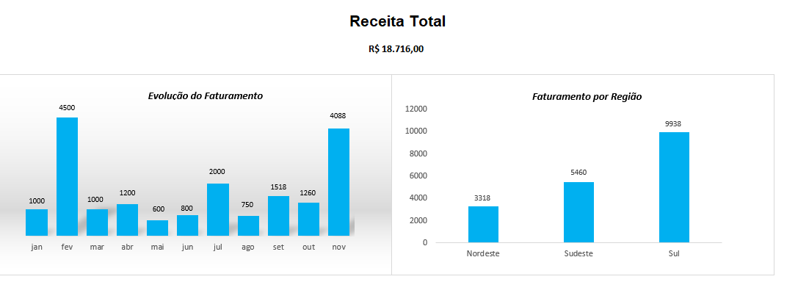

# 📊 Dashboard Excel - Análise de Vendas

## 🎯 Objetivo

Analisar o faturamento de vendas e identificar padrões para apoiar a tomada de decisão.

## 📈 O que foi desenvolvido

* Dashboard interativo no Excel
* Análise de faturamento por região
* Evolução do faturamento ao longo do tempo
* Indicador de receita total

## 🛠️ Ferramentas utilizadas

* Microsoft Excel
* Tabelas dinâmicas
* Gráficos dinâmicos

## 📸 Visual do Projeto

## 📁 Arquivo

* dashboard-excel-vendas.xlsx
